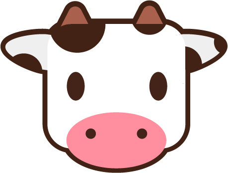

# The Farmyard 

## Setup (not tested)

### 1. Cloning the project
### 2. Setup project
Once cloned, open the project and run `yarn install`

### 3. Start project 
Site: run `yarn start` and open on [http://localhost:3000/](http://localhost:3000/)

Storybook: run `yarn storybook` and open on [http://localhost:6006](http://localhost:6006) 

## Main scripts
- start
- build
- storybook

## Project timeline
[x] UX Design 
[x] React 
[x] Storybook 
[x] Github workflows
[x] Github pages
